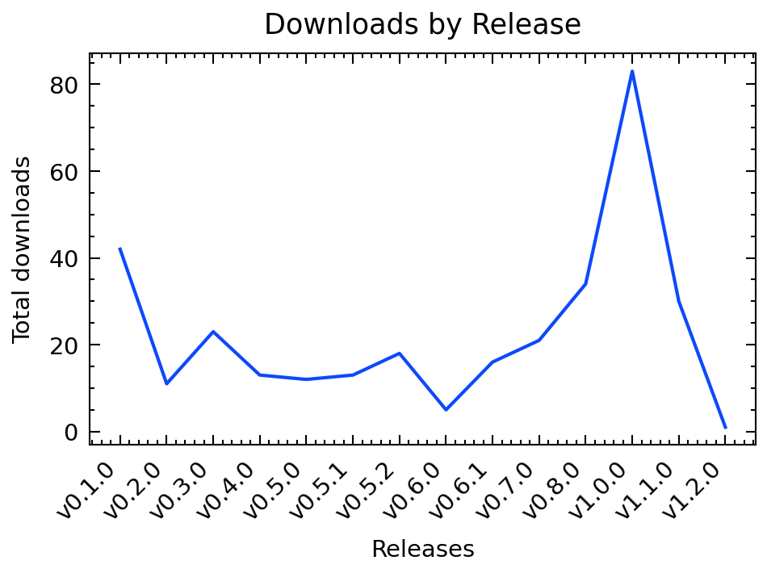
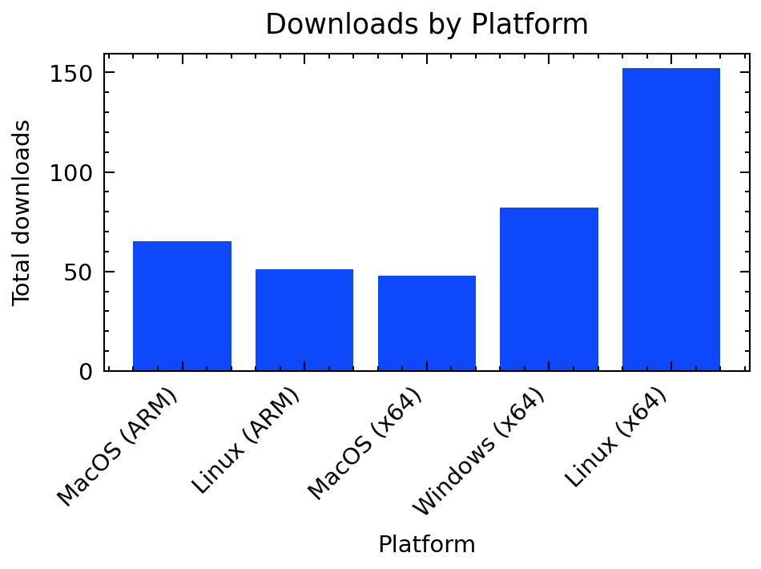
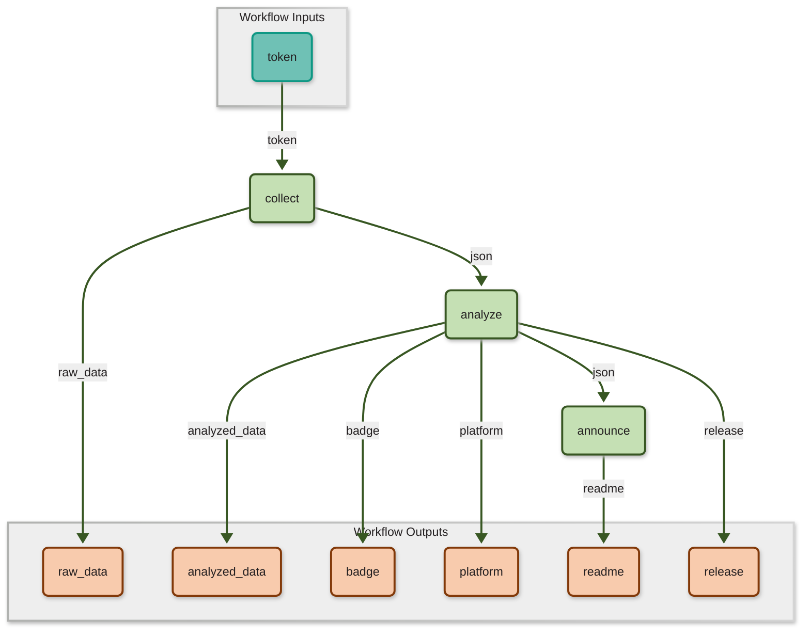

# Metrics for SciWIn-Client


SciWIn-Client helps users creating **Computational Workflows** in CWL. Detailed Information about SciWIn-Client can be found in the [GitHub Repository](https://github.com/fairagro/m4.4_sciwin_client). The Metrics shown below have been calculated using the GitHub API. Presentation is done via a CWL Workflow and the scripts in this repository.

## Downloads by Version
SciWIn-Client currently has about 199 overall downloads across all versions and operating systems. The lastest version v1.0.0 currently has 19 downloads.





| Version | Downloads |
|---------|-----------|
| v1.0.0 | 19|
| v0.8.0 | 34|
| v0.7.0 | 16|
| v0.6.1 | 14|
| v0.6.0 | 4|
| v0.5.2 | 16|
| v0.5.1 | 9|
| v0.5.0 | 10|
| v0.4.0 | 11|
| v0.3.0 | 18|
| v0.2.0 | 7|
| v0.1.0 | 41|


## Downloads by Operating System
SciWIn-Client is used on all major operating systems. There are 108 downloads of the Linux executable, 39 downloads of the Windows executable and 52 downloads of the Mac OS executable.





| Platform | Downloads |
|---------|-----------|
| MacOS (ARM) | 31|
| Linux (ARM) | 26|
| MacOS (x64) | 21|
| Windows (x64) | 39|
| Linux (x64) | 82|


## Creating this Workflow
This Metrics are collected by a CWL Workflow which was created using SciWIn-Client itself.

The first tool being used in the `collect` tool which was created by the following command. Note that `--no-commit` option, which is needed to not leak my GitHub Token. The token was manually replaced by an input variable.
```bash
s4n create -c Dockerfile -t metrics --env .env --enable-network --no-commit  python metrics/collect.py \> raw_data.json
```
The other tools are quite easy to create_
```bash
s4n create -c Dockerfile -t metrics python metrics/analyze.py --json raw_data.json \> analyzed_data.json 
s4n create -c Dockerfile -t metrics python metrics/announce.py --json analyzed_data.json
```
 
The connections are created as follows:
```bash
s4n connect pipeline --from @inputs/token --to collect/token

s4n connect pipeline --from collect/raw_data --to analyze/json
s4n connect pipeline --from analyze/analyzed_data --to announce/json

s4n connect pipeline --from collect/raw_data --to @outputs/raw_data 
s4n connect pipeline --from analyze/analyzed_data --to @outputs/analyzed_data
s4n connect pipeline --from analyze/badge --to @outputs/badge
s4n connect pipeline --from analyze/platform --to @outputs/platform
s4n connect pipeline --from analyze/release --to @outputs/release
s4n connect pipeline --from announce/README --to @outputs/readme
```

