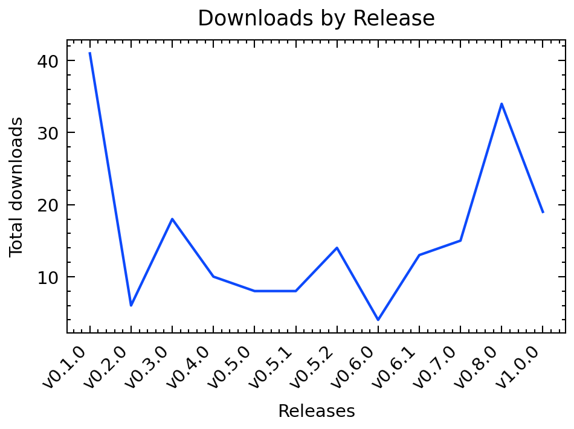

# Metrics for SciWIn-Client


SciWIn-Client helps user creating **Computational Workflows** in CWL. Detailed Information about SciWIn-Client can be found in the [GitHub Repository](https://github.com/fairagro/m4.4_sciwin_client). The Metrics shown below have been calculated using the GitHub API. Presentation is done via a CWL Workflow.

# Downloads by Version
SciWIn-Client currently has about 174 overall downloads across all versions and operating systems. The lastest version v1.0.0 currently has 15 downloads.



| Version | Downloads |
|---------|-----------|
| v1.0.0 | 15|
| v0.8.0 | 34|
| v0.7.0 | 15|
| v0.6.1 | 10|
| v0.6.0 | 4|
| v0.5.2 | 12|
| v0.5.1 | 6|
| v0.5.0 | 6|
| v0.4.0 | 7|
| v0.3.0 | 18|
| v0.2.0 | 6|
| v0.1.0 | 41|


# Downloads by Operating System
SciWIn-Client is used on all major operating systems. There are 93 downloads of the linux executable, 33 downloads of the Windows executable and 48 downloads of the Mac OS executable.


| Platform | Downloads |
|---------|-----------|
| MacOS (ARM) | 29|
| Linux (ARM) | 21|
| MacOS (x64) | 19|
| Windows (x64) | 33|
| Linux (x64) | 72|


# Creating this Workflow
The first tool being used in the `collect` tool which was created by the following command. Note that `--no-commit` option, which is needed to not leak my GitHub Token. The token was manually replaced by an input variable.
```bash
s4n create -c Dockerfile -t metrics --env .env --enable-network --no-commit  python metrics/collect.py \> raw_data.json
```
The other tools are quite easy to create_
```bash
s4n create -c Dockerfile -t metrics python metrics/analyze.py --json raw_data.json \> analyzed_data.json 
```