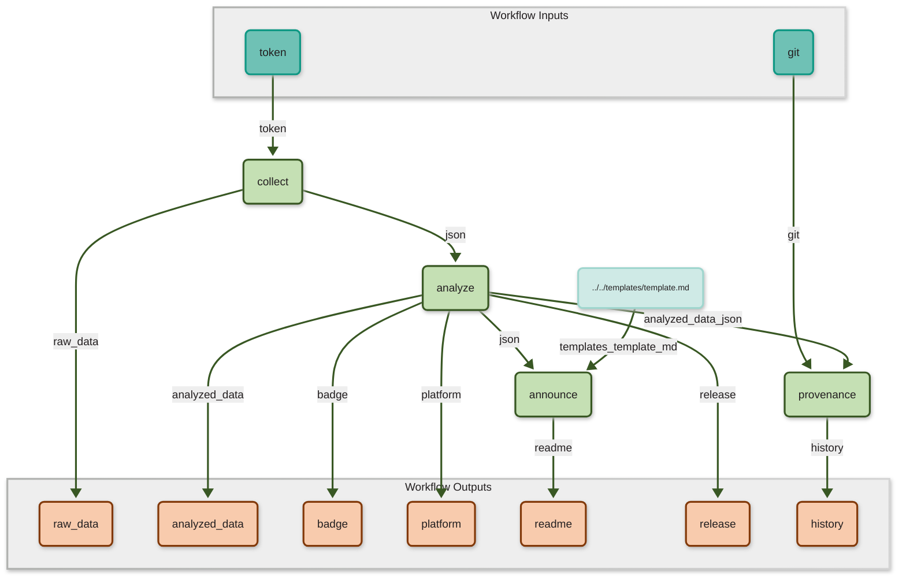

# Metrics for SciWIn
The Metrics shown below have been calculated using the GitHub API for each of the {{software|length}} SciWIn projects tracked in this repository. Presentation is done via a CWL Workflow and the scripts in this repository.


## {{sw.title}}


{{sw.description}} Detailed information about {{sw.title}} can be found in the [GitHub Repository]({{sw.url}}).

### Downloads by Version
{{sw.title}} currently has about {{sw.downloads}} overall downloads across all versions and operating systems. The latest version {{sw.latest_version}} currently has {{sw.latest_downloads}} downloads.


| Version | Downloads |
|---------|-----------|
| {{key}} | {{value}}|


### Downloads by Operating System
There are {{sw.os.get('Linux', 0)}} downloads of the Linux build, {{sw.os.get('Windows', 0)}} downloads of the Windows build and {{sw.os.get('MacOS', 0)}} downloads of the macOS build.


| Platform | Downloads |
|---------|-----------|
| {{key}} | {{value}}|



## Historical Download Chart
The historical download chart below shows how the {{total_downloads}} combined downloads across all tracked projects progressed over time, using the commited data of this repository.


## Creating this Workflow
This Metrics are collected by a CWL Workflow which was created using SciWIn-Client itself.

The first tool being used in the `collect` tool which was created by the following command. Note that `--no-commit` option, which is needed to not leak my GitHub Token. The token was manually replaced by an input variable.
```bash
s4n create -c Dockerfile -t metrics --env .env --enable-network --no-commit  python metrics/collect.py \> raw_data.json
```
The other tools are quite easy to create_
```bash
s4n create -c Dockerfile -t metrics python metrics/analyze.py --json raw_data.json \> analyzed_data.json 
s4n create -c Dockerfile -t metrics -i .git -i analyzed_data.json python metrics/provenance.py \> provenance_data.json
s4n create -c Dockerfile -t metrics python metrics/announce.py --json analyzed_data.json
```
 
The connections are created as follows:
```bash
s4n connect pipeline --from token --to collect/token
s4n connect pipeline --from git --to provenance/git

s4n connect pipeline --from collect/raw_data --to analyze/json
s4n connect pipeline --from analyze/analyzed_data --to announce/json
s4n connect pipeline --from analyze/analyzed_data --to provenance/analyzed_data_json     

s4n connect pipeline --from collect/raw_data --to raw_data 
s4n connect pipeline --from analyze/analyzed_data --to analyzed_data
s4n connect pipeline --from analyze/badge --to badge
s4n connect pipeline --from analyze/platform --to platform
s4n connect pipeline --from analyze/release --to release
s4n connect pipeline --from announce/README --to readme
s4n connect pipeline --from provenance/history --to history
```


```mermaid
---
config:
  theme: base
  look: neo
  themeVariables:
    primaryColor: '#C5E0B4'
    primaryTextColor: '#231f20'
    secondaryColor: '#EEEEEE'
    lineColor: '#385723'    
    fontSize: 12px
    tertiaryTextColor: '#231f20'
    fontFamily: 'Fira Sans, trebuchet ms, verdana, arial'
---
flowchart TB
  linkStyle default stroke:#385723,stroke-width: 2px;
  subgraph inputs[Workflow Inputs]
    direction TB
    token(token)
    git(git)
  end
  subgraph outputs[Workflow Outputs]
    direction TB
    raw_data(raw_data)
    analyzed_data(analyzed_data)
    badge(badge)
    platform(platform)
    readme(readme)
    release(release)
    history(history)
  end
    collect(collect)
  token --> |token|collect
    analyze(analyze)
  collect --> |json|analyze
    announce(announce)
  analyze --> |json|announce
    announce_templates_template_md(../../templates/template.md)
  announce_templates_template_md --> |templates_template_md|announce
    provenance(provenance)
  git --> |git|provenance
  analyze --> |analyzed_data_json|provenance
  collect --> |raw_data|raw_data
  analyze --> |analyzed_data|analyzed_data
  analyze --> |badge|badge
  analyze --> |platform|platform
  announce --> |readme|readme
  analyze --> |release|release
  provenance --> |history|history
  style inputs fill:#EEEEEE,stroke-width:2px;
  style token stroke:#0f9884,fill:#6FC1B5,stroke-width:2px;
  style git stroke:#0f9884,fill:#6FC1B5,stroke-width:2px;
  style outputs fill:#EEEEEE,stroke-width:2px;
  style raw_data stroke:#823909,fill:#F8CBAD,stroke-width:2px;
  style analyzed_data stroke:#823909,fill:#F8CBAD,stroke-width:2px;
  style badge stroke:#823909,fill:#F8CBAD,stroke-width:2px;
  style platform stroke:#823909,fill:#F8CBAD,stroke-width:2px;
  style readme stroke:#823909,fill:#F8CBAD,stroke-width:2px;
  style release stroke:#823909,fill:#F8CBAD,stroke-width:2px;
  style history stroke:#823909,fill:#F8CBAD,stroke-width:2px;
  style collect stroke:#385723,stroke-width:2px;
  style analyze stroke:#385723,stroke-width:2px;
  style announce stroke:#385723,stroke-width:2px;
  style announce_templates_template_md font-size:9px,fill:#cfeae6, stroke:#9FD6CE,stroke-width:2px;
  style provenance stroke:#385723,stroke-width:2px;
```
