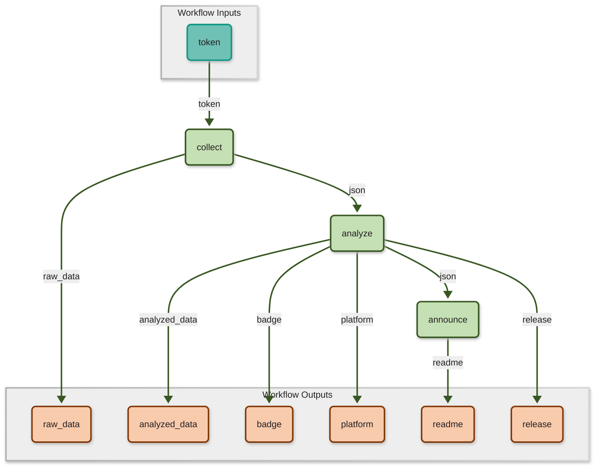

# Metrics for SciWIn-Client


SciWIn-Client helps user creating **Computational Workflows** in CWL. Detailed Information about SciWIn-Client can be found in the [GitHub Repository](https://github.com/fairagro/m4.4_sciwin_client). The Metrics shown below have been calculated using the GitHub API. Presentation is done via a CWL Workflow.

## Downloads by Version
SciWIn-Client currently has about {{downloads}} overall downloads across all versions and operating systems. The lastest version {{latest_version}} currently has {{latest_downloads}} downloads.


| Version | Downloads |
|---------|-----------|
| {{key}} | {{value}}|


## Downloads by Operating System
SciWIn-Client is used on all major operating systems. There are {{os['Linux']}} downloads of the linux executable, {{os['Windows']}} downloads of the Windows executable and {{os['MacOS']}} downloads of the Mac OS executable.


| Platform | Downloads |
|---------|-----------|
| {{key}} | {{value}}|


## Creating this Workflow
This Metrics are collected by a CWL Workflow which was created using SciWIn-Client itself.

The first tool being used in the `collect` tool which was created by the following command. Note that `--no-commit` option, which is needed to not leak my GitHub Token. The token was manually replaced by an input variable.
```bash
s4n create -c Dockerfile -t metrics --env .env --enable-network --no-commit  python metrics/collect.py \> raw_data.json
```
The other tools are quite easy to create_
```bash
s4n create -c Dockerfile -t metrics python metrics/analyze.py --json raw_data.json \> analyzed_data.json 
s4n create -c Dockerfile -t metrics python metrics/announce.py --json analyzed_data.json
```
 
The connections are created as follows:
```bash
s4n connect pipeline --from @inputs/token --to collect/token

s4n connect pipeline --from collect/raw_data --to analyze/json
s4n connect pipeline --from analyze/analyzed_data --to announce/json

s4n connect pipeline --from collect/raw_data --to @outputs/raw_data 
s4n connect pipeline --from analyze/analyzed_data --to @outputs/analyzed_data
s4n connect pipeline --from analyze/badge --to @outputs/badge
s4n connect pipeline --from analyze/platform --to @outputs/platform
s4n connect pipeline --from analyze/release --to @outputs/release
s4n connect pipeline --from announce/README --to @outputs/readme
```

